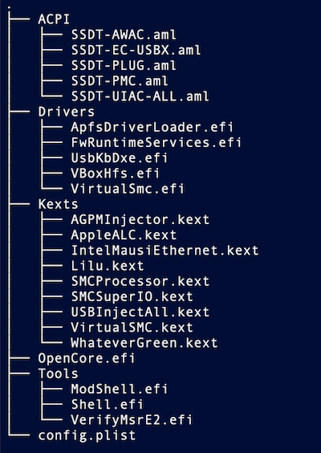

# Overview

Z390 based build using OpenCore to create a stable and fast backup workstation and testbed. 

# Hardware

- **Motherboard**: [Gigabyte Aorus Z390 Pro](https://smile.amazon.com/GIGABYTE-Z390-AORUS-PRO-Motherboard/dp/B07HRZRBRJ/)
- **CPU**: [Intel i7-8700k](https://smile.amazon.com/gp/product/B07598VZR8/)
- **RAM**: [Corsair Vengeance LPX 3200 MHz DDR4 64GB (16GBx4)](https://smile.amazon.com/gp/product/B07CZ6Q7VT) 
- **Graphics Card**: [Sapphire Radeon Vega 64](https://smile.amazon.com/Saphire-Radeon-Rx-Vega-AMD/dp/B074SR3NBX/)
- **NVMe**: Samsung 960 EVO 512GB
- **Power Supply**: [Seasonic 650W 80 Plus Titanium](https://smile.amazon.com/gp/product/B01HXYRJYK)
- **Case**: [Antec P280](https://smile.amazon.com/gp/product/B005X3E5BO)
- **Cooler**: [Corsair H75 water cooler](https://smile.amazon.com/gp/product/B00FZHWFEW)
- **Bluetooth**: [Fenvi T919](https://smile.amazon.com/gp/product/B07VCCZS54)
- **USB Audio**: [RME ADI-2 Pro fs](https://www.rme-audio.de/adi-2-pro-fs.html)
- **USB Audio**: [Topping DX7s](https://www.amazon.com/Topping-Balanced-Headphone-Amplifier-2ES9038Q2M/dp/B07B4VFS21)

## Bluetooth

Works OOB will full support. 

## Audio 

I haven't tested the onboard audio much, so may have to play with the `layout-id` a bit yourself if it's not working 100%. 

## NVRAM 

Native NVRAM support is now finally possible for the Z390. 

# Installation

## BIOS & RAM

Follow the steps in the guides linked below for BIOS settings but if you're going with 4 DIMMS and/or 64GB, beware of using XMP. Through much trial and error with different sets of RAM and motherboards (Z370 & Z390), I've found that it's not stable, neither Crucial nor Corsair, even though rated for and containing XMP profiles for 3200mhz, if you're having any crashes or freezes, just set "Ai Tweaker" to Auto (which sets the RAM to 2400mhz). 

## Steps

1. Prepare OpenCore USB
   1. Follow this easy and excellent guide, use the Coffee Lake section: https://khronokernel-2.gitbook.io/opencore-vanilla-desktop-guide/
   2. Pay special attention to the useful Troubleshooting section: https://khronokernel-2.gitbook.io/opencore-vanilla-desktop-guide/troubleshooting/troubleshooting
2. Create Vanilla Installer: https://hackintosh.gitbook.io/-r-hackintosh-vanilla-desktop-guide/
   1. Ignore the Clover sections, we're using OpenCore

## Notes 

### Compiling DSL to AML:

1. Open the DSL file with MaciASL
2. Click the Compile button 
3. Check the output and make sure you have no errors
4. File -> Save As: Make sure to select "ACPI Machine Language Binary" as the File Format
5. Copy the binary .aml files to `EC/OC/ACPI` (not the .dsl source files)

### Update config.plist

Make sure to update the `PlatformInfo/Generic` section in the supplied `config.plist` from this repo with your own generated serial etc following the Vanilla Guide, see [Platform Info section](https://khronokernel-2.gitbook.io/opencore-vanilla-desktop-guide/config.plist/coffee-lake#coffee-lake)

### Using XCode to add/edit data fields in plist

Not super intuitive how to add hex data using XCode, for `0xabcdef` enter the following verbatim (make sure the field type is set to `data`): `<abcdef>`

## OpenCore Layout

# Post Installation

* Create AGPMInjector.kext https://github.com/Pavo-IM/AGPMInjector
* Map USB ports: https://github.com/thenephilim13/macOS/tree/master/asus_prime_z370a-ii/usb

## Creds

Thanks to the entire Acidanthera team for the excellent work, nice to see some actual software engineers with a clean workflow contributing massively to this ecosystem. 
